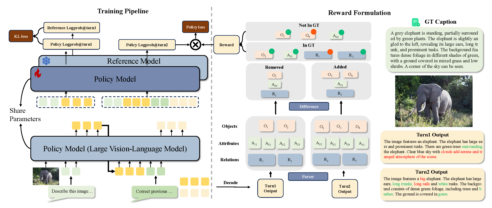

<h1>SC-Captioner: Improving Image Captioning with Self-Correction by Reinforcement Learning</h1>

[](https://arxiv.org/abs/2508.06125)
[](https://huggingface.co/datasets/zl2048/SC-Captioner-data) 

## 🔥 News

* **`2025.09`** 🌟 We released SC-Captioner, a reinforcement learning method to improve image captioning with self-correction.

## Introduction

We propose SC-Captioner, a reinforcement learning framework that enables the self-correcting capability of image caption models. Our crucial technique lies in the design of the reward function to incentivize accurate caption corrections. Specifically, the predicted and reference captions are decomposed into object, attribute, and relation sets using scene-graph parsing algorithms. We calculate the set difference between sets of initial and self-corrected captions to identify added and removed elements. These elements are matched against the reference sets to calculate correctness bonuses for accurate refinements and mistake punishments for wrong additions and removals, thereby forming the final reward. For image caption quality assessment, we propose a set of metrics refined from CAPTURE that alleviate its incomplete precision evaluation and inefficient relation matching problems. Furthermore, we collect a fine-grained annotated image caption dataset, RefinedCaps, consisting of 6.5K diverse images from COCO dataset. Experiments show that applying SC-Captioner on large visual-language models can generate better image captions across various scenarios, significantly outperforming the direct preference optimization training strategy.

<p align="center">
    
</p>

## Installation
Our code is built upon a specific version of [LLaMA-Factory](https://github.com/hiyouga/LLaMA-Factory) and based on Qwen2-VL. Other versions are not tested.
### 1. Download, create a conda environment and install PyTorch
```bash
git clone https://github.com/zl2048/SC-Captioner.git
cd SC-Captioner
conda create -n xxx python=3.10
conda activate xxx
```
Then install Pytorch.

### 2. Install transformers and LLaMA-Factory

```bash
pip install transformers==4.45.0
pip install -e .
```

### 3. Install other dependencies

```bash
pip install openai==1.45.0
pip install trl==0.12.0 --no-deps
pip install capture_metric rouge-chinese jieba
```

## Data preparation

### 1. Download Images

Download images from [DOCCI](https://google.github.io/docci/) and [COCO](https://cocodataset.org/#download)

### 2. Download and Process Labels

Training and testing labels for DOCCI, RefinedCaps (coco6k), DOCCI500, COCO-LN500 can be processed as follows:
1) Download json file from [The Huggingface space](https://huggingface.co/datasets/zl2048/SC-Captioner-data/tree/main/llamafactory_json)
2) Rewrite the image path in the json file using `process_json.py` (please change the "json_file_path" and "image_directory" in `process_json.py`)
3) Put it under the `data/` folder 

## Training

### 1. SFT

Download checkpoints of Qwen2-VL and change the "model_name_or_path" in config file, then
```bash
llamafactory-cli train config/qwen2vl_train_lora_sft.yaml
```

### 2. Merge Base Model and SFT Lora
```bash
llamafactory-cli export config/qwen2vl_merge.yaml
```

### 3. Train Self-correct
```bash
llamafactory-cli train config/qwen2vl_train_lora_sc.yaml
```

## Evaluation

### 1. Predict Captions
```bash
llamafactory-cli train config/qwen2vl_test_lora_sc_docci500.yaml
```

### 2. Evaluate Metrics
```bash
./run_metrics_docci500.sh saves/eval_qwen2vl/sc/docci500
```
For relation evaluation, due to the way of API use, we only provide questions.

## Acknowledgement
This repo benefits from [LLaMA-Factory](https://github.com/hiyouga/LLaMA-Factory), [Qwen2-VL](https://qwenlm.github.io/blog/qwen2-vl), and [TRL](https://github.com/huggingface/trl). Thanks for their wonderful works.

## Citation

If you find the provided code or models useful for your research, consider citing them as:
```
@article{zhang2025sc,
  title={SC-Captioner: Improving Image Captioning with Self-Correction by Reinforcement Learning},
  author={Zhang, Lin and Zeng, Xianfang and Li, Kangcong and Yu, Gang and Chen, Tao},
  journal={arXiv preprint arXiv:2508.06125},
  year={2025}
}
```